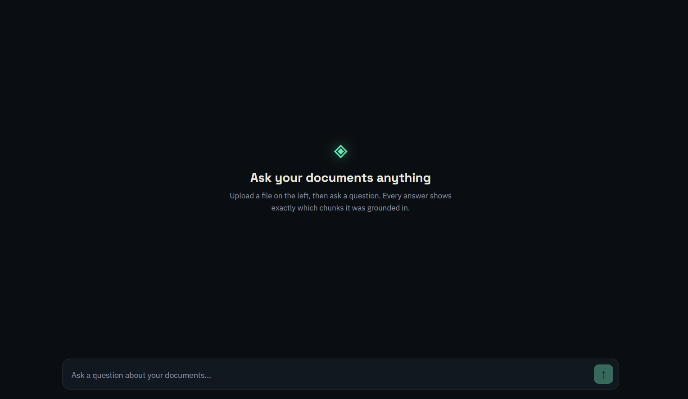
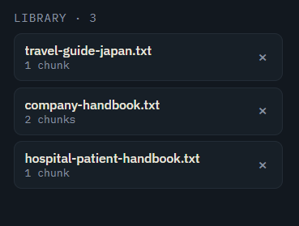
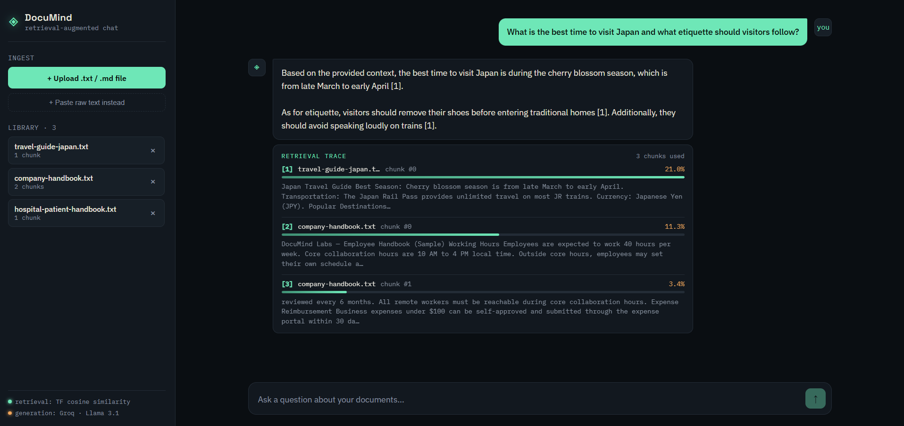
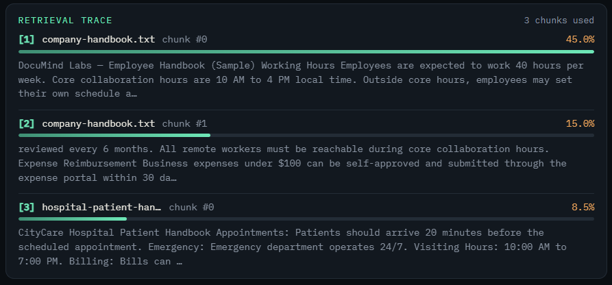
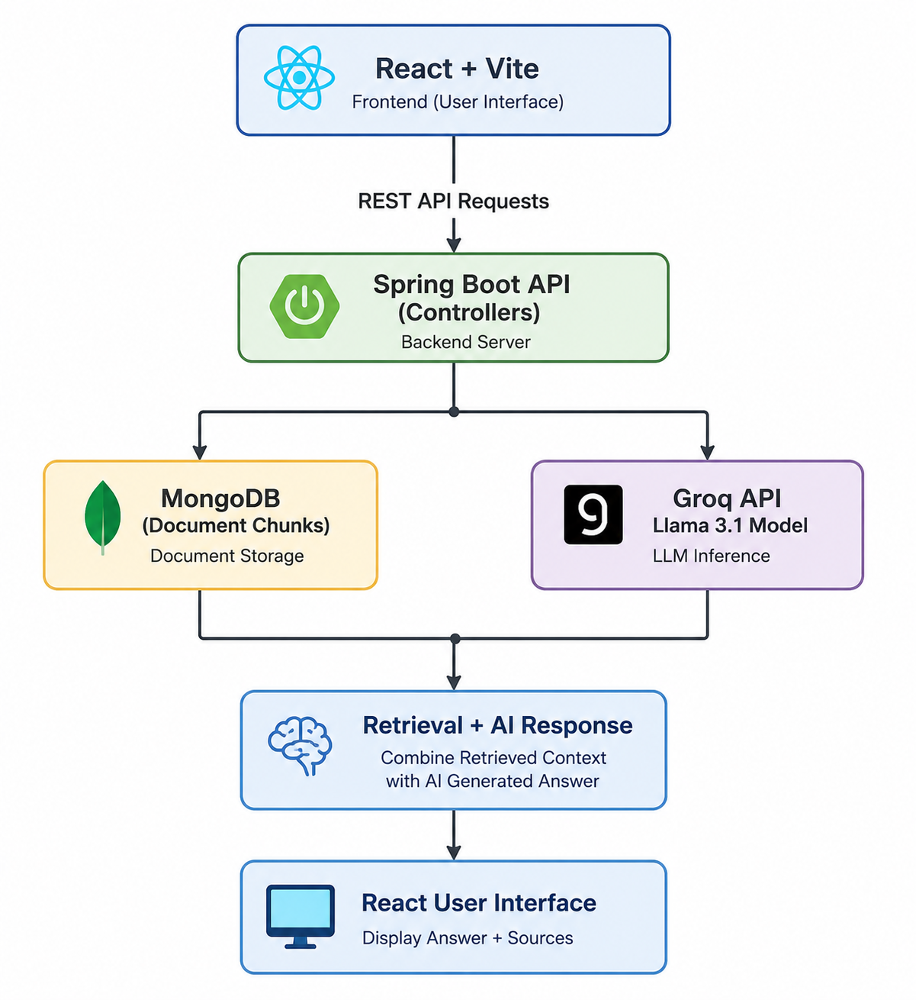

# 📚 DocuMind

<p align="center">

AI-powered Retrieval-Augmented Generation (RAG) application that enables users to upload documents and ask intelligent questions grounded in document content.

Built using **Spring Boot**, **React**, **MongoDB**, and **Groq Llama 3.1**.

</p>

---

## ✨ Features

- 📄 Upload TXT and Markdown documents
- 🔍 TF-Cosine Similarity Retrieval
- 🤖 AI-powered answers using Groq Llama 3.1
- 📚 Multi-document support
- 🧩 Automatic document chunking
- 📊 Retrieval Trace visualization
- ⚡ Fast Spring Boot REST API
- 💾 MongoDB document storage
- 🎨 Clean and responsive React UI

---

# 🖥️ Application

<p align="center">

</p>

---

# 📸 Screenshots

## Home

<p align="center">

</p>

---

## Upload Documents

<p align="center">

</p>

---

## AI Answer

<p align="center">

</p>

---

## Retrieval Trace

<p align="center">

</p>

---

# 🏗️ Architecture

<p align="center">

</p>

---

# ⚙️ Tech Stack

## Frontend

- React
- Vite
- JavaScript
- CSS

## Backend

- Spring Boot
- Java 17+
- Maven

## Database

- MongoDB

## AI

- Groq API
- Llama 3.1
- Retrieval-Augmented Generation (RAG)

---

# 🔄 Application Flow

```
User Uploads Document
        │
        ▼
Spring Boot Backend
        │
        ▼
Document Chunking
        │
        ▼
MongoDB Storage
        │
        ▼
User Asks Question
        │
        ▼
TF-Cosine Similarity Retrieval
        │
        ▼
Relevant Chunks Retrieved
        │
        ▼
Groq Llama 3.1
        │
        ▼
Grounded AI Response
        │
        ▼
React UI + Retrieval Trace
```

---

# 📂 Project Structure

```
documind
│
├── backend
│
├── frontend
│
├── docs
│
├── sample-docs
│
├── README.md
│
├── LICENSE
│
└── .gitignore
```

---

# 🚀 Getting Started

## Prerequisites

- Java 17+
- Maven
- Node.js 18+
- MongoDB
- Groq API Key

---

## Backend

```bash
cd backend

mvn spring-boot:run
```

Runs on:

```
http://localhost:8080
```

---

## Frontend

```bash
cd frontend

npm install

npm run dev
```

Runs on:

```
http://localhost:5173
```

---

# 🔑 Configuration

Create an environment variable:

```
GROQ_API_KEY=your_api_key
```

Or configure it inside:

```
application.properties
```

---

# 📖 Sample Workflow

1. Start MongoDB.
2. Run the backend.
3. Run the frontend.
4. Upload one or more documents.
5. Ask questions.
6. Review the retrieval trace.
7. Receive grounded AI responses.

---

# 📑 Sample Questions

### Employee Handbook

- How many annual leave days are provided?
- What are the core working hours?

### Travel Guide

- What is the best time to visit Japan?
- What etiquette should visitors follow?

### Hospital

- What are the visiting hours?
- How long does it take to receive medical reports?

---

# 🚀 Future Improvements

- PDF Support
- Semantic Embeddings
- Vector Database Integration
- Streaming AI Responses
- Chat History
- Authentication
- Multiple Collections
- Document Search
- Source Highlighting

---

# 📄 License

This project is licensed under the MIT License.

See the **LICENSE** file for details.

---

# 👨‍💻 Author

**A Chandhana**

Computer Science Engineering Student

Interested in Full Stack Development, Artificial Intelligence, LLMs, and Retrieval-Augmented Generation (RAG).